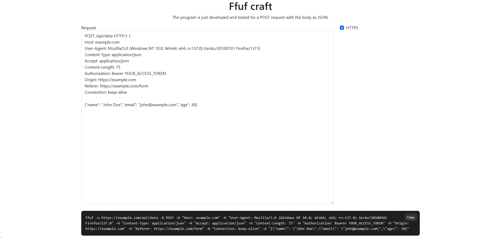

# ffuf-craft

ffuf-craft is a simple interface that converts a request into a command line format for use with the ffuf tool, streamlining the process of fuzz testing and enhancing efficiency.

```markdown


## 🛠️ Installation & Running

```bash
# Clone the repo
git clone https://github.com/your-username/my-static-website.git

# Navigate to the project folder
cd my-static-website

# Open the index.html in your browser
open index.html
